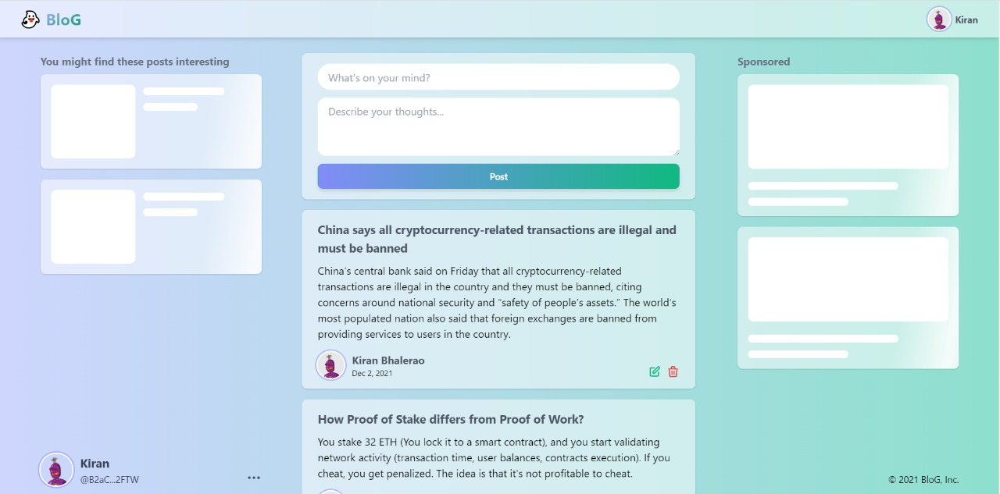

## Introduction

In this tutorial, we will learn how to create a simple blog post dapp on Solana blockchain. while building this dapp we will learn how to write the Solana rust program, Test the program and finally integrate the program with React frontend.

Blog dapp:

[Link](https://kiran-bhalerao.github.io/blog-dapp-solana/)



# Prerequisites

This tutorial assumes that you have,

- Basic understanding of React.js
- Basic understanding of Rust

## Requirements

This tutorial covers how to build a dapp on the Solana, but does not go through the installation of individual dependencies.

- **Anchor Framework -**
  Anchor is a framework used for Solana dapp development, It provides DSL to interact with the Solana program. If you are familiar with developing in Solidity, Truffle or Hardhat then consider the DSL is equivalent to ABI.
  Follow the guide to install [Anchor](https://project-serum.github.io/anchor/getting-started/installation.html#install-rust) along with Rust and Solana cli.

- **React.js -**
  To interact with our Solana program we will create client-side app with React.js.

- **Phantom Wallet -**
  Phantom is a digital wallet that lets you connect your crypto account to any dapp that build on the Solana blockchain. We will use Phantom wallet to connect to our Blog Dapp.

- **Vs code -**
  I will recommend using vscode with rust analyzer extension as it has a great support for Rust language.

## Table of Contents

- [Solana Programming model](#solana-programming-model)
- [Application design decision](#application-design-decision)
- [Setting up Local development](#setting-up-local-development)
- [Creating blog program](#creating-blog-program)
- [Writing tests for blog program](#writing-tests-for-blog-program)
- [Deploying to Devnet](#deploying-to-devnet)

Note: There will be some ethereum references just to explain some things but comprehensive etherium knowledge is not important to understand the tutorial.


## Solana Programming model

**Program -** Solana is a fast and low-cost blockchain, to achieve speed and low-cost Solana has slight different programming model. Solana uses Rust programing language to create programs as, you notice we keep saying Solana program instead of Solana smart contract from choosing programing language to naming concepts Solana is different, in Solana world smart contracts are known as Solana Programs.

**Account -** Solana programs are stateless so, if you want to store state, you need to use an account for it and accounts are fixed in size. Once the account is initialized with the size, you cannot change the size later So we have to design our application by keeping this in mind.

**Rent -** on Solana, you need to pay rent regularly to store data on the blockchain according to the space the data requires,
The account can be made rent exempt (means you won't have to pay rent) if its balance is higher than some threshold that depends on the space it is consuming.

## Application design decision

As we have learned, we need an account to create our blog dapp that has a fixed size so, if we create a single account with X size and start pushing posts inside that account, eventually the account will exceeds its size limit and we won't be able to create new posts.
If you know solidity, In solidity we create a dynamic array and push as many items to it as we want. but in Solana our accounts will be fixed in size so we have to find a solution to this problem.

- **Solution one -** What if we create an extremely large size account like in gigabytes? on Solana we need to pay rent of an account according to its size so, if our account grows in size the account rent will grow along with it.

- **Solution two -** What if we create multiple accounts and connect them somehow? Yes, Thats the plan. we will create a new account for every single post and create a chain of posts linked one after another.

Linked 🤔 yeah, you guessed it right. We will use LinkedList to connect all the posts.

## Setting up Local development

Before we start with actual development. We learn some Solana CLI commands [docs](https://docs.Solana.com/cli/conventions):

to see your current Solana configuration use:

```text
solana config get

Config File: /Users/user/.config/Solana/cli/config.yml
RPC URL: https://api.devnet.Solana.com
WebSocket URL: wss://api.devnet.Solana.com/ (computed)
Keypair Path: /home/user/.config/Solana/id.json
Commitment: confirmed
```

Your output might have different file paths.

You can check the current wallet address by:

```text
solana address
```

You can check the balance of your wallet.

```text
solana balance
```

or, You can airdrop tokens to your account.

```text
solana airdrop 1 <your-account-address>
```

Check balance again. Now you should have a balance of 1 SOL in your wallet.

**Now its time to scaffold our blog app with the help of Anchor CLI:**

```text
anchor init blog

cd blog
```

The anchor init command creates the following directories:

```text
├── app
├── programs
|   └── blog
|        └── src
|             └── lib.rs
├── test
```

Before writing program code update Anchor.toml

```text
wallet = "your Keypair Path from the output of Solana config get"
```

## Creating blog program

Now we are ready to start with the Solana rust program. Open up the `lib.rs` file located inside `/program/blog/src/` folder.

```rust
use anchor_lang::prelude::*;

declare_id!("Fg6PaFpoGXkYsidMpWTK6W2BeZ7FEfcYkg476zPFsLnS");

#[program]
pub mod blog {
    use super::*;
    pub fn initialize(ctx: Context<Initialize>) -> ProgramResult {
        Ok(())
    }
}

#[derive(Accounts)]
pub struct Initialize {}
```

This is the basic example of an anchor Solana program. There is only one function `initialize`, which will be invoked by the client.
The initialize function has one argument of type context of `Initialize` struct.

Another noticeable thing is `declare_id!`. declare_id! is a macro it defines the program address and is used in internal validation. We don't have to think about it too much. This will be handled by the Anchor CLI.

**Now its time to start declaring states of our blog app.**

```text
// pseudo code

blog {
 current_post_key    // latest post id so we can traverse back to other posts
 authority           // who owns the account
}

user {
 name                // store user name
 avatar              // user avatar
 authority           // owner
}

post {
 title              // post title
 content            // post descriptive content
 user               // user id
 pre_post_key       // to create LinkedList
 authority          // owner
}
```

As you have seen in the first basic example, we need to create function that will define out a task that we want to perform on a program like, init_blog, signup_user, create_post, etc.

we will start with creating our very first function `init_blog`.

```rust
 pub fn init_blog(ctx: Context<InitBlog>) -> ProgramResult {
        Ok(())
 }

 // define ctx type
  #[derive(Accounts)]
  pub struct InitBlog<'info> {
      #[account(init, payer = authority, space = 8 + 32 + 32)]
      pub blog_account: Account<'info, BlogState>,
      #[account(init, payer = authority, space = 8 + 32 + 32 + 32 + 32 + 8)]
      pub genesis_post_account: Account<'info, PostState>,
      pub authority: Signer<'info>,
      pub system_program: Program<'info, System>,
  }

  // from pseudo blog state
  #[account]
  pub struct BlogState {
      pub current_post_key: Pubkey,
      pub authority: Pubkey,
  }
```

As you know every function needs a typed context as the first argument, here we have defined `InitBlog` as a type of our `init_blog` ctx.
In the ctx type we have to define the account and the account will be provided by the client(caller of the function).

in `InitBlog` there are 4 accounts:

- **blog_account**
  - init attribute to create/initialize a new account
  - space = 8 + 32 + 32. Here, We are creating a new account, that's why we have to specify account size. We will see later how to calculate the account size.
  - payer = authority. authority is one of the accounts provided by the client. Authority is rent payer of blog_account.
- **genesis_post_account**
  - We are also creating this account, that's why the init, payer, and space attributes are there
  - To create LinkedList we initialize the blog account with the very first post so, we can link it to the next post.
- authority
  - program signer is a creator of the blog.
- system_program
  - required by the runtime for creating the account.

with `init_blog` our plan is to initialize the blog account with current_post_key and authority as blog state so lets write code for that,

```rust
  pub fn init_blog(ctx: Context<InitBlog>) -> ProgramResult {
      // get accounts from ctx
      let blog_account = &mut ctx.accounts.blog_account;
      let genesis_post_account = &mut ctx.accounts.genesis_post_account;
      let authority = &mut ctx.accounts.authority;

      // sets the blog state
      blog_account.authority = authority.key();
      blog_account.current_post_key = genesis_post_account.key();

      Ok(())
  }
```

This how easy to create an account that holds some state data with the Anchor framework.

Now, We will move to the next function, what we can do next?? user, user signup. Let's define signup function with which users can create his or her profile by providing name and avatar as inputs.

```rust
 pub fn signup_user(ctx: Context<SignupUser>) -> ProgramResult {
    Ok(())
 }
```

That's the basic skeleton to create a new function but here is how we get the name and avatar from user?? Let's see.

```rust
 pub fn signup_user(ctx: Context<SignupUser>, name: String, avatar: String) -> ProgramResult {
    Ok(())
 }
```

We can accept any number of arguments after ctx like here name and avatar as String (Rust is a statically typed language, we have to define type while defining variables). Next is `SignupUser` ctx type and `UserState` state.

```rust
#[derive(Accounts)]
pub struct SignupUser<'info> {
    #[account(init, payer = authority, space = 8 + 40 + 120  + 32)]
    pub user_account: Account<'info, UserState>,
    pub authority: Signer<'info>,
    pub system_program: Program<'info, System>,
}

#[account]
pub struct UserState {
    pub name: String,
    pub avatar: String,
    pub authority: Pubkey,
}
```

Here, We need three accounts and you already understand in the previous function all the attributes(like init, payer, space) so, I won't re-explain that here. But I will explain to you how to calculate the account space this time.
To measure account space we need to take a look at what state the account is holding. In user_account case **UserState** has 3 values to store name, avatar and authority.

| State Values | Data Types | Size (in bytes) |
| ------------ | ---------- | --------------- |
| authority    | Pubkey     | 32              |
| name         | String     | 40              |
| avatar       | String     | 120             |

**Pubkey:** Pubkey is always 32 bytes and String is variable in size so it depends on your use case.

**String:** String is an array of chars and each char takes 4 bytes in rust.

**Account Discriminator:** All accounts created with Anchor needs 8 bytes

Moving forward, Let's complete the remaining signup function

```rust
    pub fn signup_user(ctx: Context<SignupUser>, name: String, avatar: String) -> ProgramResult {
        let user_account = &mut ctx.accounts.user_account;
        let authority = &mut ctx.accounts.authority;

        user_account.name = name;
        user_account.avatar = avatar;
        user_account.authority = authority.key();

        Ok(())
    }
```

Until now, We have created 2 function `init_blog` and `signup_user` with name and avatar. Specifically, `signup_user` takes two arguments. What if a user mistakenly sent the wrong name and the user wants to update it??
You guessed it right. We will create a function that allows the user to update name and avatar of their account.

```rust
  pub fn update_user(ctx: Context<UpdateUser>, name: String, avatar: String) -> ProgramResult {
      let user_account = &mut ctx.accounts.user_account;

      user_account.name = name;
      user_account.avatar = avatar;

      Ok(())
  }

 #[derive(Accounts)]
  pub struct UpdateUser<'info> {
      #[account(
          mut,
          has_one = authority,
      )]
      pub user_account: Account<'info, UserState>,
      pub authority: Signer<'info>,
  }
```

New attributes:

- **mut:** if we want to change/update account state/data we must specify the mut attribute
- **has_one:** has_one checks user_account.authority is equal to authority accounts key ie. owner of user_account is signer(caller) of update_user function

Our blog is initialized, a user is created, now what's remaining?? CRUD of the post. In the next section, We will look into the CRUD of the post entity. If you feel overwhelmed, take a break or go through what we have learned so far.

Now, Let's move to the CRUD of the post!! CRUD stands for Create Read Update Delete.

```rust
   pub fn create_post(ctx: Context<CreatePost>, title: String, content: String) -> ProgramResult {
        Ok(())
    }

    #[derive(Accounts)]
    pub struct CreatePost<'info> {
        #[account(init, payer = authority, space = 8 + 50 + 500 + 32 + 32 + 32)]
        pub post_account: Account<'info, PostState>,
        #[account(mut, has_one = authority)]
        pub user_account: Account<'info, UserState>,
        #[account(mut)]
        pub blog_account: Account<'info, BlogState>,
        pub authority: Signer<'info>,
        pub system_program: Program<'info, System>,
    }

    #[account]
    pub struct PostState {
        title: String,
        content: String,
        user: Pubkey,
        pub pre_post_key: Pubkey,
        pub authority: Pubkey,
    }
```

What do you think? Why do we need **blog_account** as mut here? Do you remember **current_post_key** field in **BlogState**. Let's look at the function body.

```rust
    pub fn create_post(ctx: Context<CreatePost>, title: String, content: String) -> ProgramResult {
        let blog_account = &mut ctx.accounts.blog_account;
        let post_account = &mut ctx.accounts.post_account;
        let user_account = &mut ctx.accounts.user_account;
        let authority = &mut ctx.accounts.authority;

        post_account.title = title;
        post_account.content = content;
        post_account.user = user_account.key();
        post_account.authority = authority.key();
        post_account.pre_post_key = blog_account.current_post_key;

        // store created post id as current post id in blog account
        blog_account.current_post_key = post_account.key();

        Ok(())
    }
```

The post is created, Now we can let the client know that the post is created. The client can fetch the post and render it into the UI. Anchor provides a handy feature of emitting an event, Event?? Yup, you read it right. We can emit an event like post-created. Before emitting an event, We need to define it.

```rust

#[event]
pub struct PostEvent {
    pub label: String, // label is like 'CREATE', 'UPDATE', 'DELETE'
    pub post_id: Pubkey, // created post
    pub next_post_id: Option<Pubkey>, // for now ignore this, we will use this when we emit delete event
}
```

Let's emit a post created event from `post_create` function

```rust
    pub fn create_post(ctx: Context<CreatePost>, title: String, content: String) -> ProgramResult {
        ....

        emit!(PostEvent {
            label: "CREATE".to_string(),
            post_id: post_account.key(),
            next_post_id: None // same as null
        });

        Ok(())
    }
```

Next, Update Post.

```rust
    pub fn update_post(ctx: Context<UpdatePost>, title: String, content: String) -> ProgramResult {
        let post_account = &mut ctx.accounts.post_account;

        post_account.title = title;
        post_account.content = content;

        emit!(PostEvent {
            label: "UPDATE".to_string(),
            post_id: post_account.key(),
            next_post_id: None // null
        });

        Ok(())
    }


    #[derive(Accounts)]
    pub struct UpdatePost<'info> {
        #[account(
            mut,
            has_one = authority,
        )]
        pub post_account: Account<'info, PostState>,
        pub authority: Signer<'info>,
    }
```

Updating post is really simple, take title and content from user and update the **mut post_account**

Delete post is little challenging. To store posts, We have used LinkedList. If you know LinkedList, After deleting a node from LinkedList, we need to link the adjacent node of deleting a node. Let's understand this through a diagram.

 

If we want to delete 2nd post, We have to link 1 -> 3.

Let's jump to the code, I know you will understand it easily.

```rust
    // Here, We need two post account, current_post and next_post account. we get pre_post of current_post from current_post and link it to next_post

    pub fn delete_post(ctx: Context<DeletePost>) -> ProgramResult {
        let post_account = &mut ctx.accounts.post_account;
        let next_post_account = &mut ctx.accounts.next_post_account;

        next_post_account.pre_post_key = post_account.pre_post_key;

        emit!(PostEvent {
            label: "DELETE".to_string(),
            post_id: post_account.key(),
            next_post_id: Some(next_post_account.key())
        });

        Ok(())
    }

    #[derive(Accounts)]
    pub struct DeletePost<'info> {
        #[account(
            mut,
            has_one = authority,
            close = authority,
            constraint = post_account.key() == next_post_account.pre_post_key
        )]
        pub post_account: Account<'info, PostState>,
        #[account(mut)]
        pub next_post_account: Account<'info, PostState>,
        pub authority: Signer<'info>,
    }
```

**constraint** attribute performs simple if check.

So to delete a post, user needs to send post_account and next_post_account. But what if there is no next_post?? what if user wants to delete the latest post that has no next post??
To handle this case, We need to create another function **delete_latest_post**

```rust
    pub fn delete_latest_post(ctx: Context<DeleteLatestPost>) -> ProgramResult {
        let post_account = &mut ctx.accounts.post_account;
        let blog_account = &mut ctx.accounts.blog_account;

        blog_account.current_post_key = post_account.pre_post_key;

        emit!(PostEvent {
            label: "DELETE".to_string(),
            post_id: post_account.key(),
            next_post_id: None
        });

        Ok(())
    }

    #[derive(Accounts)]
    pub struct DeleteLatestPost<'info> {
        #[account(
            mut,
            has_one = authority,
            close = authority
        )]
        pub post_account: Account<'info, PostState>,
        #[account(mut)]
        pub blog_account: Account<'info, BlogState>,
        pub authority: Signer<'info>,
    }
```

That was the last function of our Rust Program.

Next is the Testing program. Don't worry, we'll fast forward to the next section.

## Writing tests for blog program

Before we dive into writing test cases, every test needs an initialized blog, a brand new user, and a post. To avoid repetition, we will create 3 simple reusable utility functions.

- createBlog - initialize new Blog account
- createUser - create a new User
- createPost - create new Post

**createBlog.js**

```js
const anchor = require("@project-serum/anchor");

const { SystemProgram } = anchor.web3;

// we will discus the parameters when we use it
async function createBlog(program, provider) {
  const blogAccount = anchor.web3.Keypair.generate(); // creates random keypair
  const genesisPostAccount = anchor.web3.Keypair.generate(); // creates random keypair

  await program.rpc.initBlog({
    accounts: {
      authority: provider.wallet.publicKey,
      systemProgram: SystemProgram.programId,
      blogAccount: initBlogAccount.publicKey,
      genesisPostAccount: genesisPostAccount.publicKey,
    },
    signers: [initBlogAccount, genesisPostAccount],
  });

  const blog = await program.account.blogState.fetch(initBlogAccount.publicKey);

  return { blog, blogAccount, genesisPostAccount };
}

module.exports = {
  createBlog,
};
```

**createUser.js**

```js
const anchor = require("@project-serum/anchor");
const { SystemProgram } = anchor.web3;

async function createUser(program, provider) {
  const userAccount = anchor.web3.Keypair.generate();

  const name = "user name";
  const avatar = "https://img.link";

  await program.rpc.signupUser(name, avatar, {
    accounts: {
      authority: provider.wallet.publicKey,
      userAccount: userAccount.publicKey,
      systemProgram: SystemProgram.programId,
    },
    signers: [userAccount],
  });

  const user = await program.account.userState.fetch(userAccount.publicKey);
  return { user, userAccount, name, avatar };
}

module.exports = {
  createUser,
};
```

**createPost.js**

```js
const anchor = require("@project-serum/anchor");
const { SystemProgram } = anchor.web3;

async function createPost(program, provider, blogAccount, userAccount) {
  const postAccount = anchor.web3.Keypair.generate();
  const title = "post title";
  const content = "post content";

  await program.rpc.createPost(title, content, {
    // pass arguments to the program
    accounts: {
      blogAccount: blogAccount.publicKey,
      authority: provider.wallet.publicKey,
      userAccount: userAccount.publicKey,
      postAccount: postAccount.publicKey,
      systemProgram: SystemProgram.programId,
    },
    signers: [postAccount],
  });

  const post = await program.account.postState.fetch(postAccount.publicKey);
  return { post, postAccount, title, content };
}

module.exports = {
  createPost,
};
```

Now we are ready to write our first test case. Open up the test file located in `/test/blog.js` directory. We will write all the test cases inside the `blog.js` file.

```js
const anchor = require("@project-serum/anchor");
const assert = require("assert");

describe("blog tests", () => {
  const provider = anchor.Provider.env();
  anchor.setProvider(provider);
  const program = anchor.workspace.BlogSol;

  it("initialize blog account", async () => {
    // call the utility function
    const { blog, blogAccount, genesisPostAccount } = await createBlog(
      program,
      provider
    );

    assert.equal(
      blog.currentPostKey.toString(),
      genesisPostAccount.publicKey.toString()
    );

    assert.equal(
      blog.authority.toString(),
      provider.wallet.publicKey.toString()
    );
  });
});
```

Next, run the test:

```text
anchor test
```

After running `anchor test` you will see the 1/1 test passing.

Now we complete the remaining tests, we will write all the test cases below the previous test case inside `blog.js` file.

```js
const anchor = require("@project-serum/anchor");
const assert = require("assert");

describe("blog tests", () => {
  const provider = anchor.Provider.env();
  anchor.setProvider(provider);
  const program = anchor.workspace.BlogSol;

  it("initialize blog account", async () => {
    const { blog, blogAccount, genesisPostAccount } = await createBlog(
      program,
      provider
    );

    assert.equal(
      blog.currentPostKey.toString(),
      genesisPostAccount.publicKey.toString()
    );

    assert.equal(
      blog.authority.toString(),
      provider.wallet.publicKey.toString()
    );
  });

  it("signup a new user", async () => {
    const { user, name, avatar } = await createUser(program, provider);

    assert.equal(user.name, name);
    assert.equal(user.avatar, avatar);

    assert.equal(
      user.authority.toString(),
      provider.wallet.publicKey.toString()
    );
  });

  it("creates a new post", async () => {
    const { blog, blogAccount } = await createBlog(program, provider);
    const { userAccount } = await createUser(program, provider);

    const { title, post, content } = await createPost(
      program,
      provider,
      blogAccount,
      userAccount
    );

    assert.equal(post.title, title);
    assert.equal(post.content, content);
    assert.equal(post.user.toString(), userAccount.publicKey.toString());
    assert.equal(post.prePostKey.toString(), blog.currentPostKey.toString());
    assert.equal(
      post.authority.toString(),
      provider.wallet.publicKey.toString()
    );
  });

  it("updates the post", async () => {
    const { blog, blogAccount } = await createBlog(program, provider);
    const { userAccount } = await createUser(program, provider);
    const { postAccount } = await createPost(
      program,
      provider,
      blogAccount,
      userAccount
    );

    // now update the created post
    const updateTitle = "Updated Post title";
    const updateContent = "Updated Post content";
    const tx = await program.rpc.updatePost(updateTitle, updateContent, {
      accounts: {
        authority: provider.wallet.publicKey,
        postAccount: postAccount.publicKey,
      },
    });

    const post = await program.account.postState.fetch(postAccount.publicKey);

    assert.equal(post.title, updateTitle);
    assert.equal(post.content, updateContent);
    assert.equal(post.user.toString(), userAccount.publicKey.toString());
    assert.equal(post.prePostKey.toString(), blog.currentPostKey.toString());
    assert.equal(
      post.authority.toString(),
      provider.wallet.publicKey.toString()
    );
  });

  it("deletes the post", async () => {
    const { blogAccount } = await createBlog(program, provider);
    const { userAccount } = await createUser(program, provider);
    const { postAccount: postAcc1 } = await createPost(
      program,
      provider,
      blogAccount,
      userAccount
    );

    const { post: post2, postAccount: postAcc2 } = await createPost(
      program,
      provider,
      blogAccount,
      userAccount
    );

    const {
      post: post3,
      postAccount: postAcc3,
      title,
      content,
    } = await createPost(program, provider, blogAccount, userAccount);

    assert.equal(postAcc2.publicKey.toString(), post3.prePostKey.toString());
    assert.equal(postAcc1.publicKey.toString(), post2.prePostKey.toString());

    await program.rpc.deletePost({
      accounts: {
        authority: provider.wallet.publicKey,
        postAccount: postAcc2.publicKey,
        nextPostAccount: postAcc3.publicKey,
      },
    });

    const upPost3 = await program.account.postState.fetch(postAcc3.publicKey);
    assert.equal(postAcc1.publicKey.toString(), upPost3.prePostKey.toString());

    assert.equal(upPost3.title, title);
    assert.equal(upPost3.content, content);
    assert.equal(upPost3.user.toString(), userAccount.publicKey.toString());
    assert.equal(
      upPost3.authority.toString(),
      provider.wallet.publicKey.toString()
    );
  });
});
```

Run again:

```text
anchor test
```

# Building frontend

Now, We're ready to build out the front end. We will create a new react app inside the existing app directory.

```text
cd app
npx create-react-app .
```

The directory structure of a basic React app made with `create-react-app`:

```text
├── public
├── src
|   └── app.js
├── package.json
```

Before we start writing the frontend part of the tutorial we will create a simple script that will copy the program idl file to the React app. Whenever we deploy our rust program with anchor deploy the Anchor CLI generates the idl file that has all the metadata related to our rust program (this metadata helps to build the client-side interface with the Rust program).

Create `copy_idl.js` file in the root of your project and copy the code given below. The code is just copying the idl file from `/target/idl` to the `/app/src` directory.

```js
const fs = require("fs");
const blog_idl = require("./target/idl/blog_sol.json");

fs.writeFileSync("./app/src/idl.json", JSON.stringify(blog_idl, null, 2));
```

Next, install dependencies.

```
npm i @solana/wallet-adapter-react @solana/wallet-adapter-wallets @solana/web3.js
```

Next, open `app/src/App.js` and update it with the following:

```js
import {
  ConnectionProvider,
  WalletProvider,
} from "@solana/wallet-adapter-react";
import { getPhantomWallet } from "@solana/wallet-adapter-wallets";
import { Home } from "./home";

const wallets = [getPhantomWallet()];
const endPoint = "http://127.0.0.1:8899";

const App = () => {
  return (
    <ConnectionProvider endpoint={endPoint}>
      <WalletProvider wallets={wallets} autoConnect>
        <Home />
      </WalletProvider>
    </ConnectionProvider>
  );
};

export default App;
```

In the further tutorial, I'm just gonna explain the logical part of our dapp and I'll leave the styling part up to you.

Now, Let's start with the login functionality of our dapp. We will need a button that handles the user login with Phantom browser wallet.

create button inside Home.js component with `onConnect` onClick handler like this,

```JSX
<button onClick={onConnect}>Connect with Phantom</button>
```

Then create `onConnect` function that handles the click event of connect button.

```js
import { WalletName } from "@solana/wallet-adapter-wallets";
import { useWallet } from "@solana/wallet-adapter-react";

// inside react component
const { select } = useWallet();
const onConnect = () => {
  select(WalletName.Phantom);
};
```

Let's deploy our Rust program first then copy the idl file with the help of the `copy_idl.js` script that we wrote before,

Before deploy make sure you have `localnet` cluster set in Anchor.toml file. Now
open up a new Terminal session and run the `solana-test-validator` command. This will start a local network of the Solana blockchain.

```text
solana-test-validator
```

then deploy the program with,

```text
anchor deploy
```

If you run into an error,

- Make sure `solana-test-validator` is running
- Make sure your Solana config is in a valid state (I mean the RPC url, KeyPair path etc.)

Once you successfully deploy the Rust program with the anchor CLI then run the `copy_idl.js` file like,

```text
node copy_idl.js
```

It will copy the idl file to `/app/src` directory, now you will see the `idl.json` file inside `/app/src` directory.

## Initialize Blog

Now we will initialize the blog. Initializing blog is one-time process. Let's create `init_blog.js` file inside the `/app/src` folder and copy the code given below.

```js
import { Program } from "@project-serum/anchor";
import { Keypair, PublicKey, SystemProgram } from "@solana/web3.js";
import idl from "./idl.json";

const PROGRAM_KEY = new PublicKey(idl.metadata.address);

export async function initBlog(walletKey, provider) {
  const program = new Program(idl, PROGRAM_KEY, provider);
  const blogAccount = Keypair.generate();
  const genesisPostAccount = Keypair.generate();

  await program.rpc.initBlog({
    accounts: {
      authority: walletKey,
      systemProgram: SystemProgram.programId,
      blogAccount: blogAccount.publicKey,
      genesisPostAccount: genesisPostAccount.publicKey,
    },
    signers: [blogAccount, genesisPostAccount],
  });

  console.log("Blog pubkey: ", blogAccount.publicKey.toString());
}
```

In this `initBlog` function we have imported the program idl then we have generated two Keypair for blog account and initial dummy post account and after that we just call the initBlog function of the program with all the necessary accounts. we are creating two new accounts here `blogAccount` and `genesisPostAccount` that's why we have to pass it as signers.

Now the UI part of this, we will create a temporary button to call the `initBlog` function. Once the blog is initialized we will remove the button, as it won't be needed anymore.

```JSX
  import {
    useAnchorWallet,
    useConnection
  } from "@solana/wallet-adapter-react";
  import idl from './idl.json'

  const PROGRAM_KEY = new PublicKey(idl.metadata.address);
  const BLOG_KEY = /* new PublicKey(blog key) */;

  // inside react component
  const { connection } = useConnection();
  const wallet = useAnchorWallet();

  const _initBlog = () => {
    const provider = new Provider(connection, wallet, {});
    initBlog(provider.wallet.publicKey, provider);
  };

  <button onClick={_initBlog}>Init blog</button>
```

The `initBlog` function will create a brand new Blog and console log its publicKey. Make sure you still have `solana-test-validator` running in another terminal and your Phantom wallet is connected to the local network (`http://localhost:8899`)

If you don't know how to connect the Phantom wallet to Localnet here are the steps,

- Go to settings tab in Phantom wallet
- Scroll down and select **change network**
- Finally choose **Localhost**

Next, you need balance in your account on Localnet to get balance you need to run the following command.

```text
solana airdrop 1 <your-account-address>
```

Then check your account balance with the command:

```text
solana balance <your-account-address>
```

You will see `1 SOL` printed on your terminal.

Once you are connected to the Localhost you are ready to initialize the blog account. Run the app with `npm run start` it will open up your Dapp in your browser there you will see two buttons one is `connect` and another one is `init blog`. The first step is to connect to the Phantom wallet by clicking `connect` button. Once you are connected then click on the `init blog` button. it will trigger the Phantom wallet confirmation popup click `Approve`. After 1 to 2 sec the `initBlog` function will console log the publicKey of your blog account, just copy the blog publicKey and store it in `BLOG_KEY` variable and that's it. We have successfully initialized our blog account.

```js
const BLOG_KEY = new PublicKey(your - blog - key);
```

Your blog is initialized now you can comment out the `init blog` button as well the `_initBlog` function.

## Signup user

Now we will move to the part where the user enters his/her name and avatar URL and we will initialize his/her account.

Let's create two input fields one for user name and another for user avatar.

```JSX
 <input placeholder="user name" />
 <input placeholder="user avatar" />
```

Next attach React state to the input fields and create `signup` button

```JSX
 const [name, setName] = useState("")
 const [avatar, setAvatar] = useState("")

 const _signup = ()=> {

 }

 <input placeholder="user name" value={name} onChange={e => setName(e.target.value)} />
 <input placeholder="user avatar" value={avatar} onChange={e => setAvatar(e.target.value)} />
 <button onClick={_signup}>Signup</button>
```

Now we will write the functionality of the `_signup` function,
If you remember the `initBlog` function, there we have randomly generated Keypair but in this case, we won't generate the Keypair randomly as we need to identify the user for all the subsequent logins.

`Keypair` has `fromSeed` function that takes a `seed` argument and generates a unique Keypair from the given seed.

So we will create a seed by combining `PROGRAM_KEY` and users `wallet_key` so it will create a unique Keypair.

```js
import { Keypair, PublicKey, SystemProgram } from "@solana/web3.js";
import { Program, Provider } from "@project-serum/anchor";

const genUserKey = (PROGRAM_KEY, walletKey) => {
  const userAccount = Keypair.fromSeed(
    new TextEncoder().encode(
      `${PROGRAM_KEY.toString().slice(0, 15)}__${walletKey
        .toString()
        .slice(0, 15)}`
    )
  );

  return userAccount;
};
```

Let's complete the `_signup` function,

```js
const _signup = async () => {
  const provider = new Provider(connection, wallet, {});
  const program = new Program(idl, PROGRAM_KEY, provider);
  const userAccount = genUserKey(PROGRAM_KEY, provider.wallet.publicKey);

  await program.rpc.signupUser(name, avatar, {
    accounts: {
      authority: provider.wallet.publicKey,
      userAccount: userAccount.publicKey,
      systemProgram: SystemProgram.programId,
    },
    signers: [userAccount],
  });
};
```

Now we have created user account next we will fetch the user account to see whether user has already signed up.

```jsx
import { useEffect, useState } from "react";

// inside react component
const fetchUser = async () => {
  const provider = new Provider(connection, wallet, {});
  const program = new Program(idl, PROGRAM_KEY, provider);
  const userAccount = genUserKey(PROGRAM_KEY, provider.wallet.publicKey);

  const _user = await program.account.userState.fetch(userAccount.publicKey);

  return _user;
};

const [user, setUser] = useState();
// fetch user when wallet is connected
useEffect(() => {
  if (wallet?.publicKey) {
    fetchUser()
      .then((user) => {
        setUser(user);
      })
      .catch((e) => console.log(e));
  }
}, [wallet]);

// if the user is not undefined then show user name and user avatar in UI
// otherwise show signup form to the user

{
  user ? (
    <>
      <h1>user name: {user.name}</h1>
      <h1>user avatar: {user.avatar} </h1>
    </>
  ) : (
    <>
      <input
        placeholder="user name"
        value={name}
        onChange={(e) => setName(e.target.value)}
      />
      <input
        placeholder="user avatar"
        value={avatar}
        onChange={(e) => setAvatar(e.target.value)}
      />
      <button onClick={_signup}>Signup</button>{" "}
    </>
  );
}
```

## Create post

First we will create a form to take post title and post content from user input.

```jsx
    const [title, setTitle] = useState("");
    const [content, setContent] = useState("");


     const _createPost = async ()=> {

     }

    <input
      placeholder="post title"
      value={title}
      onChange={(e) => setTitle(e.target.value)}
    />
    <input
      placeholder="post content"
      value={content}
      onChange={(e) => setContent(e.target.value)}
    />
    <button onClick={_createPost}>Create post</button>
```

Now we can complete the `_createPost` function

```js
const _createPost = async () => {
  const provider = new Provider(connection, wallet, {});
  const program = new Program(idl, PROGRAM_KEY, provider);
  const postAccount = Keypair.generate();
  const userAccount = genUserKey(PROGRAM_KEY, provider.wallet.publicKey);

  await program.rpc.createPost(title, content, {
    accounts: {
      blogAccount: BLOG_KEY,
      authority: provider.wallet.publicKey,
      userAccount: userAccount.publicKey,
      postAccount: postAccount.publicKey,
      systemProgram: SystemProgram.programId,
    },
    signers: [postAccount],
  });
};
```

here we have passed the `BLOG_KEY` the same key that we have obtained by initializing the blog.

Now we will fetch all the posts created on our Blog. If you remember the Rust program, we have attached the previous post id to the current post, here we will use the previous post id to iterate over the list of posts. To do so, we will create a function that finds the post of a given post id.

```js
const getPostById = async (postId) => {
  const provider = new Provider(connection, wallet, {});
  const program = new Program(idl, PROGRAM_KEY, provider);

  try {
    const post = await program.account.postState.fetch(new PublicKey(postId));

    const userId = post.user.toString();
    if (userId === SystemProgram.programId.toString()) {
      return;
    }

    return {
      id: postId,
      title: post.title,
      content: post.content,
      userId,
      prePostId: post.prePostKey.toString(),
    };
  } catch (e) {
    console.log(e.message);
  }
};
```

To loop over all the posts we need latest post id and we can find the latest post id from the blog state.
create `fetchAllPosts` function as,

```js
const fetchAllPosts = async () => {
  const provider = new Provider(connection, wallet, {});
  const program = new Program(idl, PROGRAM_KEY, provider);

  // read the blog state
  const blog = await program.account.blogState.fetch(BLOG_KEY);

  const latestPostId = blog.currentPostKey.toString();
  const posts = [];

  let nextPostId = latestPostId;
  while (!!nextPostId) {
    const post = await getPostById(nextPostId, program);
    if (!post) {
      break;
    }

    posts.push(post);
    nextPostId = post.prePostId;
  }

  return posts;
};
```

Now trigger the fetchAllPosts function when the user login with the Phantom wallet.

```js
const [posts, setPosts] = useState([]);

// fetch all the posts when wallet is connected
useEffect(() => {
  if (wallet?.publicKey) {
    fetchAllPosts()
      .then((posts) => {
        setPosts(posts);
      })
      .catch((e) => console.log(e));
  }
}, [wallet]);
```

Show posts in the UI

```jsx
{
  posts.map(({ title, content }, i) => {
    return (
      <div key={i}>
        <h2>{title}</h2>
        <p>{content}</p>
      </div>
    );
  });
}
```

## Todo

Till now, we have integrated initialization of blog, user signup, fetch user, create post, fetch all the posts there still some part is remaining like,

- update user
- update post
- delete post

If you follow the same steps as we have learned, you can be able to complete the remaining to-do tasks.

## Deploying to Devnet

Deploying to a live network is straightforward:

1. Set Solana config to devnet

```text
solana config set --url devnet
```

2. Open Anchor.toml and Update the cluster to devnet

```toml
cluster = "devnet"
```

3. Build program

```text
anchor build
```

4. Deploy program

```text
anchor deploy
```

# Conclusion

Congratulations on finishing the tutorial. In this tutorial, We have successfully created a Rust program for Blog post Dapp on Solana Blockchain. We have also integrated the Blog post Rust program with React.js on the client side. Here, we followed a little different approach to storing and retrieving posts. The Solana blockchain is still in its beta phase so, don't bother to try experimenting. Who knows, you might find some cool patterns out of it.

There is still room for improvements in the Blog Dapp like,

- UI improvements
- Creating frontend app with Typescript
- Adding pagination while fetching all the posts
- Creating user timeline(posts created by the user)
- Adding Rxjs to fetch posts(streaming posts)

# About Author

This tutorial was created by [Kiran Bhalerao](https://github.com/kiran-bhalerao).

# References

[https://github.com/kiran-bhalerao/blog-dapp-Solana](https://github.com/kiran-bhalerao/blog-dapp-Solana)
